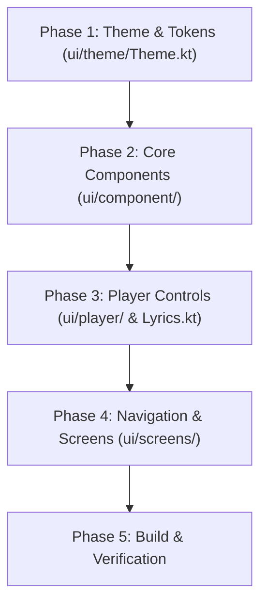

# Material 3 Expressive UI Migration Plan (OuterTune)

> **Context**: This document outlines the feasibility, architecture strategy, and step-by-step roadmap for migrating OuterTune's Jetpack Compose UI to **Material 3 Expressive**.
> For a complete map of the codebase modules, directories, and package structure, refer to [`STRUCTURE.md`](file:///home/container/pro/OuterTune/STRUCTURE.md).

---

## 1. Feasibility & Complexity Assessment

### Is it difficult?
**No, it is straightforward.**

### Key Reasons:
1. **Existing Jetpack Compose Foundation**: OuterTune is already 100% built on Jetpack Compose and Material 3 (`androidx.compose.material3:material3:1.4.0`).
2. **No Architectural Rewrite**: The state management, Media3 player integration, database, and ViewModel layers remain unchanged.
3. **Refactoring Scope**: The migration consists of upgrading component calls, shape/color tokens, motion specs, and container styling across `com.dd3boh.outertune.ui`.

---

## 2. Key Pillars of Material 3 Expressive

Material 3 Expressive introduces key visual and interactive refinements:

### A. Color & Surface Hierarchy
- Utilize M3 Expressive surface roles: `surfaceContainerLowest`, `surfaceContainerLow`, `surfaceContainer`, `surfaceContainerHigh`, and `surfaceContainerHighest`.
- Use dynamic tonal spot schemes derived from album artwork while preserving high contrast.

### B. Expressive Shape Scale & Containers
- Transition from sharp/small corners to expressive pill shapes (`CornerFull`), extra-large rounded cards (`28.dp` / `32.dp`), and rounded bottom sheet containers.

### C. Motion & Spring Animations
- Replace rigid linear/tween transitions with spring physics (`expressiveSpring()`, `DampingRatioLowBouncy`).
- Add touch-scale press feedback (`graphicsLayer { scaleX = pressScale; scaleY = pressScale }`) on interactive controls, song tiles, and play buttons.

### D. Media Player Controls
- Overhaul `PlayerSlider.kt` and `BigSeekBar.kt` with thicker, rounded expressive track shapes.
- Upgrade Play/Pause buttons in `Player.kt` to morphing shapes with spring animations.

---

## 3. Step-by-Step Execution Plan

### Phase 1: Theme & Token Setup
*Target file:* [`app/src/main/java/com/dd3boh/outertune/ui/theme/Theme.kt`](file:///home/container/pro/OuterTune/app/src/main/java/com/dd3boh/outertune/ui/theme/Theme.kt)
- Update `OuterTuneTheme` to expose full M3 Expressive `surfaceContainer` variants.
- Define global spring animation specs (`ExpressiveSpringSpec`).

### Phase 2: Reusable Components Overhaul
*Target folder:* [`app/src/main/java/com/dd3boh/outertune/ui/component/`](file:///home/container/pro/OuterTune/app/src/main/java/com/dd3boh/outertune/ui/component/)
- **Buttons (`button/`)**: Update primary, secondary, and icon buttons to use expressive pill shapes and spring scale feedback.
- **Sliders (`PlayerSlider.kt`, `BigSeekBar.kt`)**: Refactor slider tracks with expressive rounded shapes and active wave/glow indicators.
- **Search & Filter Header (`SearchBar.kt`, `ChipsRow.kt`)**: Convert search inputs and category filter chips to M3 Expressive floating rounded containers.
- **Bottom Sheet Container (`BottomSheet.kt`)**: Apply extra-large top corner radii (`28.dp`) and smooth spring drag behavior.

### Phase 3: Player UI Enhancement
*Target folder:* [`app/src/main/java/com/dd3boh/outertune/ui/player/`](file:///home/container/pro/OuterTune/app/src/main/java/com/dd3boh/outertune/ui/player/)
- **Expanded Player (`Player.kt`)**:
  - Refactor play/pause button to an expressive floating circle container with morphing spring animation.
  - Wrap album artwork in a dynamic rounded card (`32.dp` radius) with subtle elevation shadow.
- **Lyrics View (`ui/component/Lyrics.kt`)**:
  - Enhance active lyric line highlighting with smooth spring scale and expressive gradient text background.

### Phase 4: Screens & Navigation Update
*Target folder:* [`app/src/main/java/com/dd3boh/outertune/ui/screens/`](file:///home/container/pro/OuterTune/app/src/main/java/com/dd3boh/outertune/ui/screens/)
- **Dashboard & Lists (`HomeScreen.kt`, `AlbumScreen.kt`, `BrowseScreen.kt`)**:
  - Update list items (`SongItem`, `AlbumItem`) to use M3 Expressive card surfaces with press feedback.
- **Settings & Dialogs (`settings/fragments/LyricFrag.kt`, `dialog/`)**:
  - Update preference cards and drag-and-drop lists to use expressive rounded cards.

### Phase 5: Verification & Polish
- Validate UI rendering across light, dark, and dynamic artwork themes.
- Confirm smooth 60/120 FPS animation performance on player sheet expansions.

---

## 4. Guidance for AI Assistants & LLMs

When executing code edits for this migration:
1. Refer to [`STRUCTURE.md`](file:///home/container/pro/OuterTune/STRUCTURE.md) to locate exact file paths before editing.
2. Keep Jetpack Compose state management and Media3 player binding contracts intact.
3. Use standard `androidx.compose.material3` APIs without introducing conflicting third-party UI libraries.
